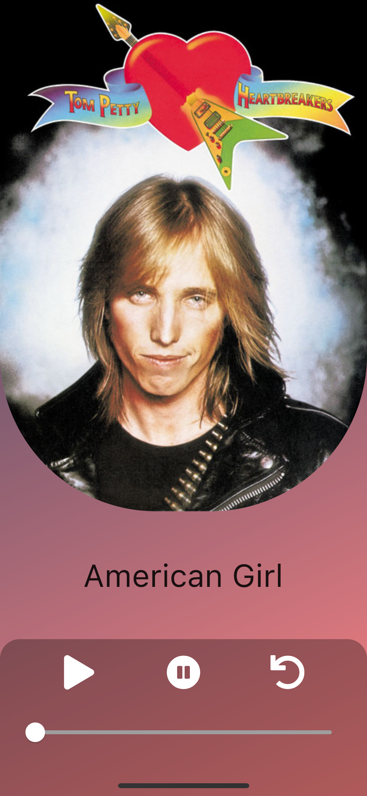

# spotifytiktok

Music Application that is powered by the Spotify Web API and designed like a Tiktok style feed.

## Goals
- listen the song ✅
- play/pause the song ✅
- swipe up/down to navigate to the next song ✅
- automatically navigate to next song on completion of current song ✅

## Features
- Created a custom carousel of playlists that fetches weekly updated tracks
- On selection of a Carousel card, the audio player plays the tracks from the relative playlist

## Steps to run the Application on your device

- Visit 'https://www.postman.com/'
- Under Workspaces, create a 'New Collection'
- Choose Type to be 'OAuth 2.0'
- Under Callback URL, paste your Spotify Callback from Spotify Developers
- Under AuthURL, AccessTokenURL, type in 'Spotify' and select the option.
- Enter the ClientID and SecretKey from Spotify Developers.
- Select Get Access Token
- Once you have received the Access Token, paste it in the AccessToken field in main.dart
